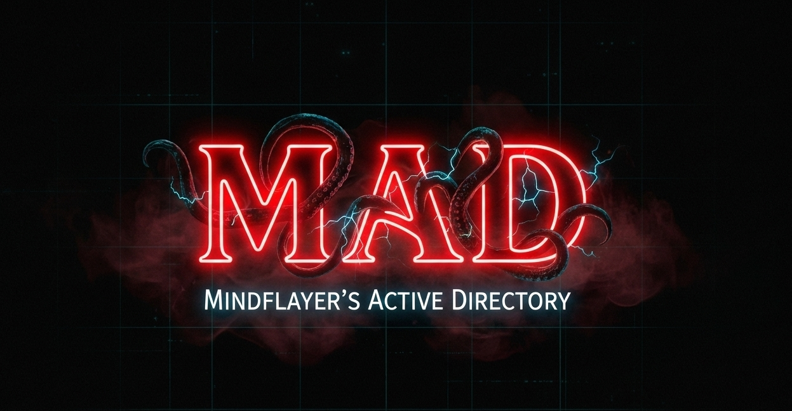

<p align="center">
  
</p>

<h1 align="center">MAD — MindFlayer’s Active Directory</h1>

<p align="center">
  A realistic Active Directory attack lab focused on real-world enterprise misconfigurations
</p>

<p align="center">
  
  
  
</p>

---

## 🧠 Overview

**MAD (MindFlayer’s Active Directory)** is a modular, hands-on Active Directory security lab designed to simulate **real-world enterprise environments with accumulated security debt**.

MAD focuses on **attack realism and discovery**, allowing learners and professionals to practice modern AD attack techniques across Windows, Linux, Kerberos, MSSQL, delegation, GPOs, and ADCS.

> **MAD teaches how vulnerabilities exist in the wild.**

Unlike infrastructure-as-code labs, MAD ships **preconfigured enterprise snapshots**, allowing users to focus on **enumeration, attack logic, and chaining** instead of provisioning complexity.

---

## 🏗️ Lab Architecture

### Active Directory Network Diagram

<p align="center">
  
</p>

### Domains / Forests

- **LAB.HAWKINS.MAD** — Child Domain
- **HAWKINS.MAD** — Primary attack surface  
- **STARCOURT.MAD** — ADCS & trust-abuse forest  

### Machines

- `VECNA-DC01` — Root Domain Controller  
- `BRENNER-DC02` — Child Domain Controller  
- `ARCADE-PC01` — MSSQL / pivot host  
- `DND-SERVER` — Linux (Kerberos / SSSD)  
- `LAB-SYSTEM01` — Web / delegation host  
- `BYERS-PC01` — User workstation  
- `STARCOURT-DC` — ADCS / CA services  

---

## ✨ Features

- Multiple **independent and alternate attack paths**
- Realistic **ACL abuse, delegation, Kerberos, MSSQL, GPO, and ADCS exploitation**
- Dedicated ADCS forest with:
  - ESC1, ESC2, ESC3, ESC5, ESC6, ESC8, ESC12
  - Certifried (CVE-2022-26923)
- Cross-domain & cross-forest trust abuse (SIDHistory enabled)
- Hybrid **Windows + Linux (Kerberos / SSSD)** attack scenarios
- Modular deployment (partial or full lab)
- Central **MAD Controller** for orchestration
- No automated exploitation or one-click attacks

---

## 🚀 Installation

### Requirements

- **CPU**: 4+ cores  
- **RAM**: 16 GB minimum (32 GB recommended)  
- **Disk**: 120 GB free  
- **Software**:
  - VirtualBox
  - Vagrant
  - Python 3.9+

---

### 🐧 Linux Installation

1. Clone the repository:
   ```bash
   git clone https://github.com/0xh3x0x/MAD.git
2. cd into MAD directory
   ```bash
   cd MAD/
3. Give executable permissions to setup script
   ```bash
   chmod +x setup.sh
4. Run setup script (Run as ROOT)
   ```bash
   ./setup.sh
5. After setup run final `mad.py` to start installation of the LAB
    ```bash
    python mad.py
### 🪟 Windows Installation
1. Clone the repository:
   ```bash
   git clone https://github.com/0xh3x0x/MAD.git
2. cd into MAD directory
   ```bash
   cd MAD/
3. Run powershell setup script
   ```bash
   .\setup.ps1
4. After setup run final `mad.py` to start installation of the LAB
    ```bash
    python mad.py